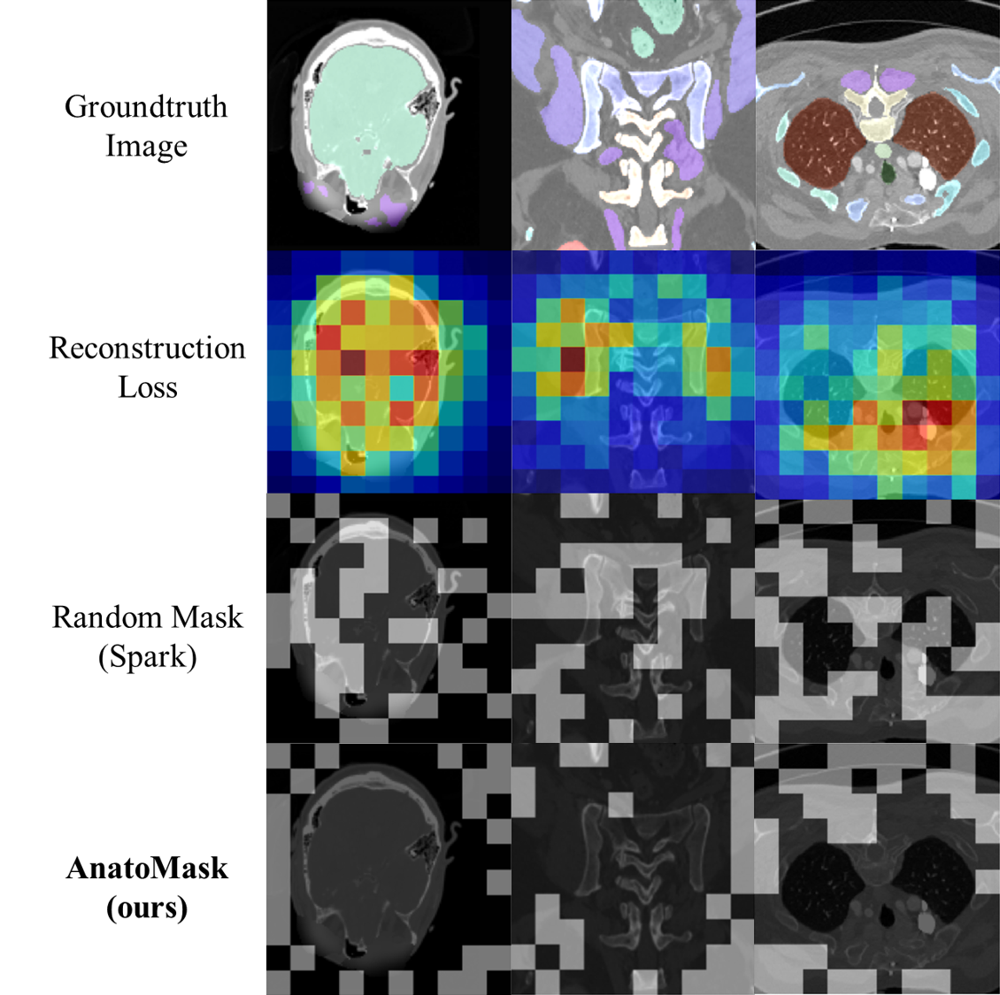
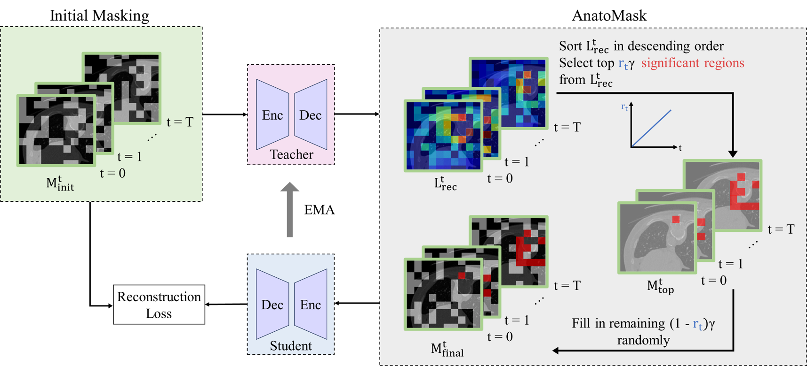

# AnatoMask: Enhancing Medical Image Segmentation with Reconstruction-guided Self-masking
[arxiv](https://arxiv.org/abs/2407.06468)

# Linux-version for AnatoMask
Please clone our repo and install nnUNetv2 from our source.

`pip install -e .`

Please also ensure setting up your system variables correctly following nnUNet's instructions:
[instructions](https://github.com/MIC-DKFZ/nnUNet/blob/master/documentation/setting_up_paths.md)

Other packages that we use:
`cuda==12.1
torch==2.0.1
simpleitk==2.3.1
`
# What is AnatoMask?
Our hypothesis is pretty simple: self-supervise using masked image modeling + ConvNet backbone = success in medical image segmentation. 
Given nnUNet's state-of-the-art performance, we want to offer the option to conduct self-supervised pretraining leveraging nnUNet's **whole pipeline**. Currently, we offer the option to use 1). **SparK**, which is the CNN equivalent of masked autoencoders and 2). **AnatoMask**, which bootstraps difficult regions for MAE objective. After pretraining on some dataset, we can transfer these weights for downstream segmentation tasks. 

Currently, our backbones are all CNNs! This ensures optimal performance for segmentation :)

# Pretraining using AnatoMask
Go to [ssl_pretrain](https://github.com/ricklisz/AnatoMask/blob/win_ver/ssl_pretrain/pretrain_AnatoMask.py)

A few things to do:
1. Set up your `output_folder = 'XXX'` This contains your saved model weights.
2. Set up your `preprocessed_dataset_folder = 'XXX/nnUNet_preprocessed/Dataset009_Spleen/nnUNetPlans_3d_fullres'` This is your preprocessed nnUNet dataset. Please be sure to preprocess your dataset first following nnUNet's tutorial!
3. Find your nnUNet splits file (or create your own split if you are so inclined). `splits_file = 'XXX/nnUNet_preprocessed/Dataset009_Spleen/splits_final.json'` You can get this by running nnUNet once on your dataset.
4. Find your dataset json file: `dataset_json = load_json('XXX/Dataset009_Spleen/dataset.json')`
5. Find your plan json file: `plans = load_json('XXX/nnUNet_preprocessed/Dataset009_Spleen/nnUNetPlans.json')`
6. Run: `python pretrain_AnatoMask.py`

Note: You can use SparK by following the same steps and run `pretrain.py` 

# Finetuning
Define your function to load pretrained weights here: [https://github.com/ricklisz/AnatoMask/blob/win_ver/nnunetv2/run/load_pretrained_weights.py](https://github.com/ricklisz/AnatoMask/blob/win_ver/nnunetv2/run/load_pretrained_weights.py)

An example is given in here: [https://github.com/ricklisz/AnatoMask/blob/win_ver/nnunetv2/run/load_pretrained_weights.py](https://github.com/ricklisz/AnatoMask/blob/win_ver/nnunetv2/run/load_pretrained_weights.py)

Import your function and replace nnUNet's `load_pretrained_weights` here: [https://github.com/ricklisz/AnatoMask/blob/win_ver/nnunetv2/run/run_training.py](https://github.com/ricklisz/AnatoMask/blob/win_ver/nnunetv2/run/run_training.py)

Finally, run your nnUNet training command as usual, but adding `-pretrained_weights PATH_TO_YOUR_WEIGHTS`

# What exactly does AnatoMask do?
We propose a reconstruction-guided masking strategy, so that the model learns the anatomically significant regions through reconstruction losses. This is done by using self-distillation. Basically, a teacher network first identifies important regions to mask and generates a more difficult mask for the student to solve.  
To prevent the network from converging to a suboptimal solution early during training, we use an easy-to-hard a masking dynamics function controlling the difficulty of the MIM objective.

#  Model Zoo
TBC

# TO DO
* Release the windows version.
* Release the linux version. DDP support.
* Release pretrained weights and finetuned weights. 

# Reference
Please cite [here](https://scholar.google.com/citations?view_op=view_citation&hl=en&user=MxO6qiIAAAAJ&sortby=pubdate&citation_for_view=MxO6qiIAAAAJ:LkGwnXOMwfcC) when using AnatoMask:

`Li, Y., Luan, T., Wu, Y., Pan, S., Chen, Y., & Yang, X. (2024). AnatoMask: Enhancing Medical Image Segmentation with Reconstruction-guided Self-masking. arXiv preprint arXiv:2407.06468.`

